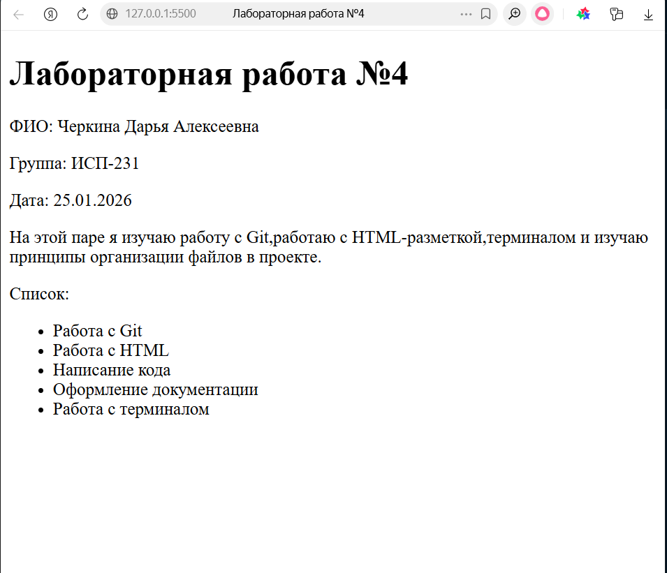
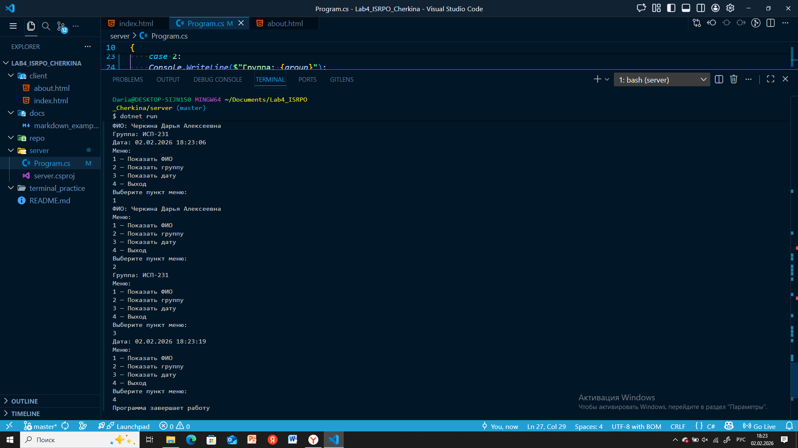
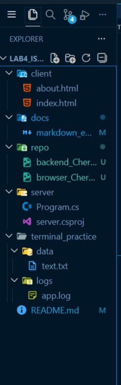

# Лабораторная работа №4. Закрепление навыков работы с Git, Markdown,терминалом и проектной структурой
---

**ФИО:** Черкина Д.А
**Группа:** ИСП-231
**Дата:** 02.02.2026 

---
## Описание проекта
Этот проект создан для закрепления навыков работы с Git, Markdown, терминалом и структурой проекта.

---
## Содержание
1. [Структура проекта](#структура-проекта)
2. [Примеры Markdown](#примеры-markdown)
3. [Скриншоты](#скриншоты-из-папки-repo)
4. [Заключение](#заключение)

---

## Структура проекта
Lab4_ISRPO_Cherkina:
* client
    * about.html
    * index.html
* docs
    * markdown_example.md
* repo
    * скрины работы 
* server
    * program.cs
* terminal_practice
    * data
    * logs
* README.md

---
## Примеры Markdown
### Заголовок
### Список
- Пункт 1
- Пункт 2

### Картинка



### Код

```csharp
Console.WriteLine("Hello, World!");
```
---

## Пример LaTeX
### Inline LaTeX
$a^2 + b^2 = c^2$

### Block LaTeX
$$
\sum_{i=1}^n i = \frac{n(n+1)}{2}
$$

---
## Ссылка на репозиторий
[Репозиторий](https://github.com/daria-chr/Lab4_ISRPO_Cherkina)

---
##  Скриншоты из папки repo





---
## Заключение
В ходе работы были освоены основные инструменты: Git, Markdown, терминал, структура проекта.